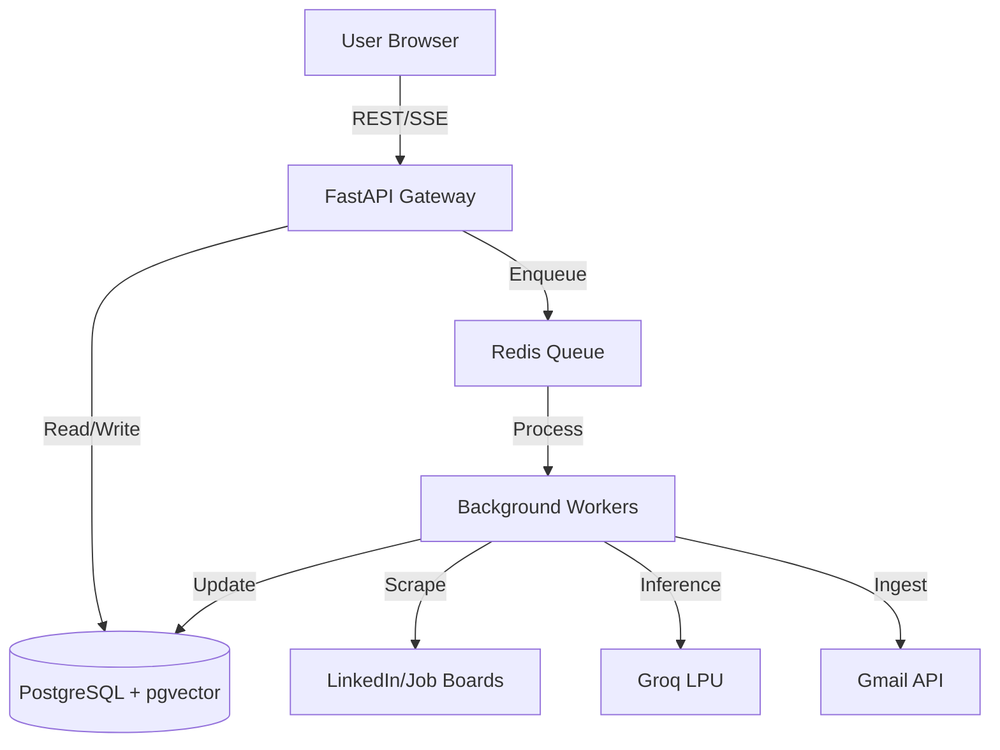

# System Design: Clawdbot Automation

## 1. High-Level Architecture
We follow a **Modular Monolith** architecture to minimize infrastructure complexity and maximize development speed during Phase 1.

- **Frontend**: React 19 (Vite) - Single Page Application.
- **Backend API**: FastAPI (Python) - Handles requests, validation, and business logic.
- **Worker Pool**: Celery/Redis - Handles long-running async tasks (Scraping, AI Tailoring, Email Ingestion). *Note: Workers require high memory (min 1GB) for Playwright/Chromium stability.*
- **Persistence**: PostgreSQL (Supabase) with `pgvector` for semantic search.
- **IPC (Frontend)**: `BroadcastChannel API` for multi-tab synchronization of real-time events.

## 2. Component Diagram

## 3. Core Workflows
1. **Job Discovery**: Scraper worker polls job boards -> Stores in DB -> Triggers Scoring. Includes selector-failure alerting.
2. **AI Tailoring**: User clicks "Tailor" -> Worker fetches Resume + JD -> Groq generates tailored content (via `Instructor` validation) -> Result saved to DB -> SSE notifies UI.
3. **Email Intelligence**: Scheduled worker checks Gmail API -> Extracts application updates -> Updates dashboard timeline. *Strict Retention:* Raw bodies are dropped immediately after summary extraction to minimize PII surface.

## 4. Key Security & Resilience
- **Auth**: Supabase Auth (JWT based).
- **Rate Limiting**: Tiered limiting on API layer.
- **Idempotency**: All job processing tasks use unique IDs to prevent duplicate LLM costs.
